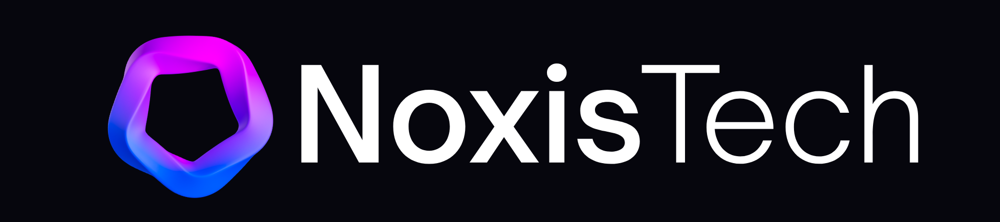

<div align="center">



# NOXIS
### AI Fairness Auditor

**Detect. Explain. Fix. AI Bias — Before It Harms.**

[](https://python.org)
[](https://flask.palletsprojects.com/)
[](https://deepmind.google/technologies/gemini/)
[](https://aif360.mybluemix.net/)
[](https://firebase.google.com/)
[](https://cloud.run)

<br/>

> *"Algorithms shouldn't inherit our biases. Noxis ensures they don't."*

<br/>

**[🚀 Live Demo](#quick-start) · [📖 How It Works](#how-it-works) · [🧪 Test Datasets](#demo-datasets) · [🗺️ Roadmap](#roadmap)**

</div>

---

## 🌍 The Problem

Every day, AI models make decisions that shape human lives — loan approvals, hiring, criminal sentencing, healthcare. But these models are trained on historical data that carries decades of systemic bias.

**The result?** A model that silently discriminates. No one notices. No one is accountable. The harm compounds.

Noxis exists to change that.

---

## ⚖️ What is Noxis?

Noxis is an **enterprise-grade AI bias auditing platform** that lets developers, data scientists, and compliance officers upload their datasets and models to instantly detect, understand, and fix hidden discrimination.

Think of it as **VirusTotal — but for AI bias.**

Upload → Scan → Get a full bias report in seconds.

---

## 🔥 Features

### 🔬 Deep Bias Detection
Powered by **IBM AIF360**, Noxis computes the industry-standard fairness metrics:
- **Disparate Impact** — Are outcomes proportional across groups?
- **Statistical Parity Difference** — Do groups receive favorable outcomes equally?
- **Equal Opportunity Difference** — Are true positive rates fair?
- **Average Odds Difference** — Are prediction errors balanced?

### 🤖 Gemini AI Copilot
- Translates raw fairness numbers into **plain English** explanations
- Live **streaming chat assistant** that knows exactly what's on your dashboard
- Context-aware answers to your specific audit results

### ⚡ 1-Click Python Mitigation
- Auto-generates a **downloadable Python script** using the Reweighing algorithm
- Mathematically offsets bias in your dataset without retraining from scratch
- Instant download of the mitigated dataset

### 📊 Interactive Visualizations
- **SHAP Feature Importance** — see which features drove the model's decisions
- **4 default charts** with editable chart types and attributes
- **Custom chart builder** — pick any chart type, any axis, add unlimited charts
- Full **PDF export** of your audit report

### ⚖️ Legal Compliance Hub
Cross-references your model against international AI fairness laws:
- 🇺🇸 **US EEOC 4/5ths Rule**
- 🗽 **NYC Local Law 144**
- 🇪🇺 **EU AI Act**

### 🔥 Adversarial Red Teaming
Acts as an offensive security tool — generates **synthetic edge cases** to expose hidden vulnerabilities like zip-code proxies for race.

### 👤 Human Impact Simulator
Puts a face to the data. Generates **realistic personas** of individuals unfairly rejected by your model so stakeholders actually feel the impact.

### 🧪 CEO Simulation Lab
An executive-ready sandbox with **What-If sliders** and a **Strategy Board** to visualize the accuracy vs. fairness tradeoff in real time.

### 🌐 Live Data Connect
Fetch and audit **live CSVs directly from GitHub or public APIs** — no file upload needed.

### 🔐 Audit History
Firebase-backed audit log tracks every analysis you run — accessible across sessions.

---

## 🛠️ Tech Stack

| Layer | Technology |
|---|---|
| **Frontend** | HTML5, CSS3, Vanilla JS, Chart.js |
| **Backend** | Python 3.9+, Flask |
| **Bias Detection** | IBM AIF360, Scikit-learn, SHAP |
| **AI / LLM** | Google Gemini via Vertex AI |
| **Auth & Database** | Firebase Authentication + Firestore |
| **Deployment** | Google Cloud Run (Docker) |

---

## 🚀 Quick Start

### 1. Clone
```bash
git clone https://github.com/yourusername/noxis.git
cd noxis
```

### 2. Install dependencies
```bash
pip install flask aif360 pandas numpy scikit-learn shap google-genai firebase-admin matplotlib python-dotenv
```

### 3. Set up credentials
Place your Firebase service account key at `fb-key.json` in the root directory.

For Vertex AI, authenticate your local environment:
```bash
gcloud auth application-default login
```

### 4. Run
```bash
python app.py
```

Navigate to `http://localhost:8080`

---

## 🧪 Demo Datasets

Test Noxis instantly using the **Live Data Connect** feature with these real-world biased datasets:

### 1. Adult Census Income — Gender Bias
```
URL:               https://raw.githubusercontent.com/google/yggdrasil-decision-forests/main/yggdrasil_decision_forests/test_data/dataset/adult.csv
Sensitive Attr:    sex
Privileged Value:  Male
Target Label:      income
Favorable Label:   1
```

### 2. ProPublica COMPAS — Racial Bias
```
URL:               https://raw.githubusercontent.com/propublica/compas-analysis/master/compas-scores-two-years.csv
Sensitive Attr:    race
Privileged Value:  Caucasian
Target Label:      two_year_recid
Favorable Label:   0
```

---

## 📐 How It Works

```
┌─────────────────────────────────────────────────────────┐
│                                                         │
│   1. UPLOAD        Upload CSV dataset + optional .pkl   │
│                    model file                           │
│                                                         │
│   2. DETECT        AIF360 computes Disparate Impact,    │
│                    Statistical Parity, Equal Opp Diff   │
│                                                         │
│   3. EXPLAIN       Gemini translates metrics to plain   │
│                    English + streaming chat assistant    │
│                                                         │
│   4. VISUALIZE     SHAP plots, 4 default charts,        │
│                    custom chart builder                  │
│                                                         │
│   5. FIX           1-click Python mitigation script     │
│                    using Reweighing algorithm            │
│                                                         │
└─────────────────────────────────────────────────────────┘
```

---

## 🌱 UN Sustainable Development Goals

<table>
<tr>
<td><strong>SDG 10 — Reduced Inequalities</strong><br/>Noxis ensures AI systems don't perpetuate systemic discrimination in housing, lending, hiring, and healthcare.</td>
<td><strong>SDG 16 — Peace, Justice & Strong Institutions</strong><br/>By auditing automated decision-making, Noxis promotes accountability and transparency in institutional AI.</td>
</tr>
</table>

---

## 🗺️ Roadmap

- [ ] **Developer API** — Integrate Noxis directly into GitHub Actions / CI-CD pipelines to block biased models from reaching production
- [ ] **Multi-Attribute Auditing** — Detect intersectional bias (e.g., race × gender simultaneously)  
- [ ] **NLP & Vision Support** — Audit bias in text models and image recognition systems
- [ ] **Team Workspaces** — Collaborative audit dashboards for enterprise compliance teams
- [ ] **Scheduled Audits** — Auto-run audits on live production model endpoints

---

## 👥 Team

**Built by Team Noxis** for the Google Solution Challenge 2026

---

<div align="center">

Built with ⚖️ to make AI fair for everyone.

**[SDG 10: Reduced Inequalities] · [SDG 16: Peace & Justice]**

</div>
